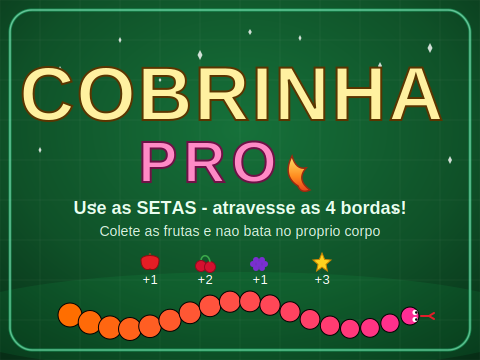
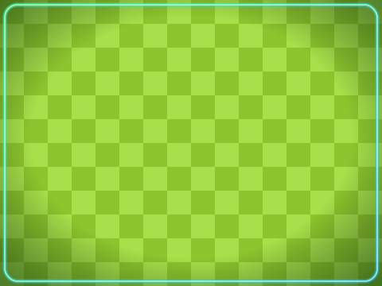
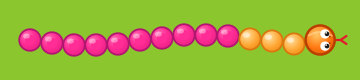

# 🐍 Cobrinha PRO

Versão turbinada do **Jogo da Cobrinha** feito no Scratch, exportada em `.sb3`
pronta para baixar e jogar (arraste o arquivo para [scratch.mit.edu](https://scratch.mit.edu/projects/editor/)
ou para o [TurboWarp](https://turbowarp.org)).

➡️ **Arquivo do jogo:** [`Cobrinha PRO.sb3`](./Cobrinha%20PRO.sb3)

## ✨ O que há de novo

| Recurso | Descrição |
|---|---|
| 🎬 **Tela inicial caprichada** | Menu com borda neon, brilhos, cobra decorativa, legenda das frutas e botão pulsante "Pressione Espaço". |
| 💀 **Morre ao bater em si mesma** | Colisão com o próprio corpo pela técnica de cor (corpo rosa-choque detectado pela cabeça, com período de carência nos segmentos novos para evitar falso-positivo). |
| ⚡ **Velocidade por nível** | A variável `velocidade` é usada de verdade: sobe de 5 → 9 conforme o nível (5/10/15/20 pontos). |
| 🔄 **Wrap-around nas 4 bordas** | Atravessa qualquer borda (cima, baixo, **esquerda e direita**) e reaparece do outro lado. Os limiares ficam dentro do *fence* de 15px do Scratch para disparar em todos os lados. |
| 🍎 **Várias frutas** | Maçã 🍎 (+1), Banana 🍌 (+1), Uva 🍇 (+1), Cereja 🍒 (+2) e Estrela ⭐ (+3, bônus). Sorteadas a cada respawn. |
| 🎨 **Cenários e atores Pró** | Novo fundo de jogo (grama xadrez + vinheta + moldura neon), menu repaginado e cobra "neon" vetorial com profundidade (cabeça laranja + corpo em degradê âmbar → rosa). |
| 🏆 **Recorde** | Guarda a maior pontuação da sessão, exibida no menu e no game over. |

## 🎮 Como jogar
- **Setas** para guiar a cobra (não dá para inverter 180° direto).
- Colete as **frutas** para crescer, pontuar e subir de nível.
- Não bata no próprio corpo.
- **Espaço / clique** para começar e para voltar ao menu.

## 🛠️ Como foi feito
Os scripts e os assets vetoriais (SVG) são gerados por código em [`src/build.py`](./src/build.py)
(usa [`src/assets.py`](./src/assets.py)), que reescreve o `project.json` do `.sb3` original.
O resultado foi validado com o `scratch-parser` oficial e carregado/executado no `scratch-vm`
(inclusive um teste automatizado confirmando o wrap nos 4 lados).

### Pré-visualização

 
